# Overview

Be the first to try the endgame of all toggle switches, we'll use LaunchDarkly to fearlessly launch this exciting new toggle switch feature! 🐻

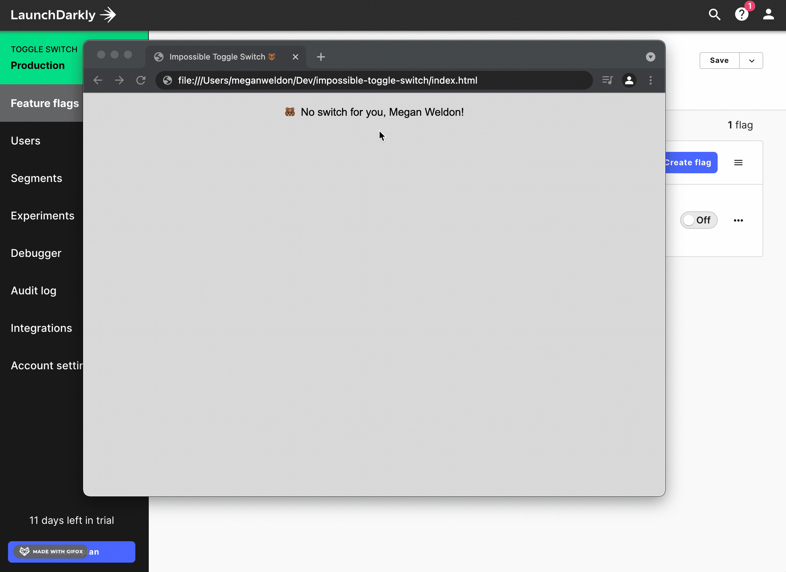

To set up this project yourself and recreate a LaunchDarkly feature flag with user targeting, check out the easy to follow guide below

# What You Will Need

- A free [LaunchDarkly](https://launchdarkly.com/start-trial/) account

- [VSCode](https://code.visualstudio.com/) (or your preferred IDE)

- Any major browser ([Google Chrome](https://www.google.com/chrome/))

# Download The Project Locally

Download [this repository](https://github.com/MWeldonLD/impossible-toggle-switch)

Or make a clone of this project using the following command:

`$ git clone https://github.com/MWeldonLD/impossible-toggle-switch.git`

# Create Feature Flag in LaunchDarkly

Create a free [LaunchDarkly](https://launchdarkly.com/start-trial/) account

- Navigate to `Account Settings` > `Projects` and select `Create Project`
- Name your new project `Toggle Switch`, Save and refresh the page
- Using the top-left dropdown menu, navigate into the `Toggle Switch` > `Production` environment

Create a Feature Flag
- As shown below, on the `Feature Flags` page create a new feature flag named: `New Toggle Switch`
- Your autogenerated feature flag key should be: `new-toggle-switch`

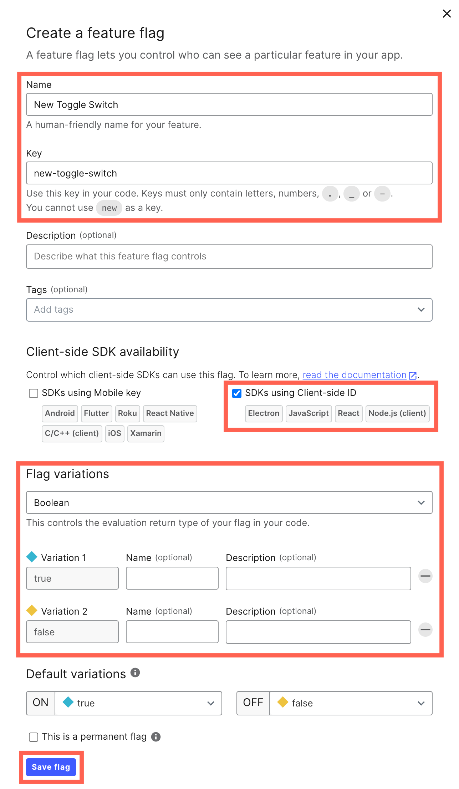

- As this is a JavaScript project, be sure to check the box for `SDKs using Client-side ID`
- Leave the Flag Variation set to `Boolean` as we want our flag to evaluate on True or False values
- Save your new feature flag

# LaunchDarkly SDK Implementation
 This project already includes a self-hosted example implementation of the LaunchDarkly JavaScript SDK. For reference, see the below script tags

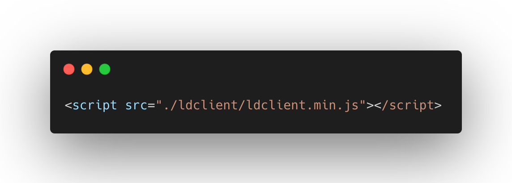

In a script tag implementation Self-hosting the LaunchDarkly SDK is a recommended best practice for production, as it will not introduce any critical dependencies on third-party service providers such as unpkg or jsDelivr

# Implementing Your Feature Flag
## Locate & Copy Your Client-side ID
- Navigate to `Account Settings` > `Projects`
- Locate your `Toggle Switch` project and copy your Production environment-specific `Client-side ID` value as shown below:

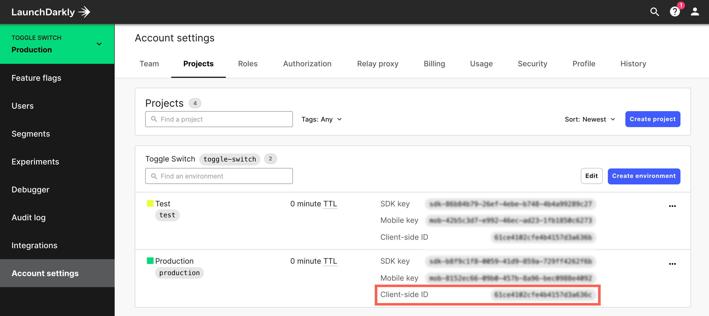

## Implement Client-side ID into Project
- In VSCode, open `script.js` for editing and locate the below:
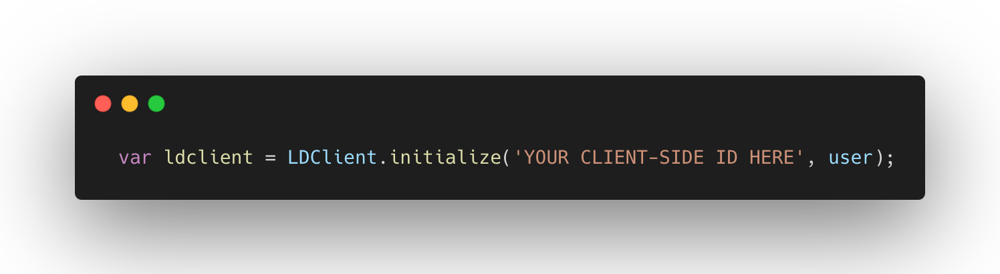
- Replace `YOUR CLIENT-SIDE ID HERE` with your environment-specific `Client-side ID` value copied from the previous step
- Save your edit

# Test Your Feature Flag
## Before Turning On Your Feature Flag
- Let's first run `index.hmtl` in VSCode before enabling your feature flag, this will run the project without the new feature being displayed for the user
- The LaunchDarkly `new-toggle-switch` flag value is evaluated as False and therefore the new feature is not rendered for the user

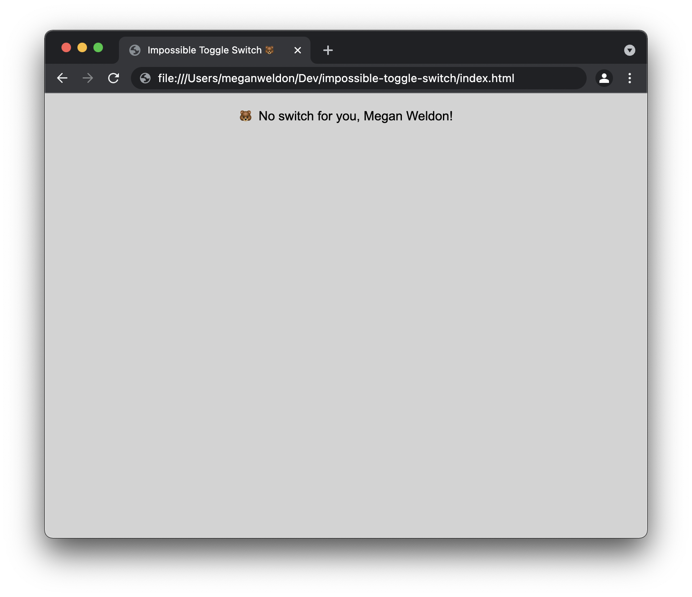

## Turn On Your Feature Flag
- Inside your LaunchDarkly `Toggle Switch` > `Production` environment on the Feature Flags page, turn on the `New Toggle Switch` feature flag
- Add an optional comment and Save Changes

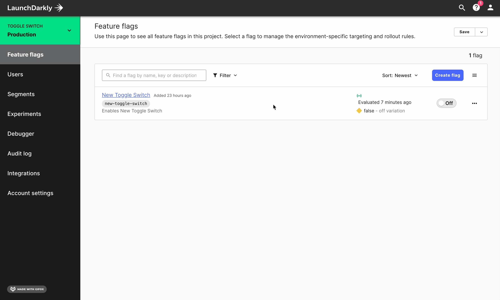

- Now let's run `index.hmtl` in VSCode with your feature flag turned on, this will run the project and display the new feature for the user
- The LaunchDarkly `new-toggle-switch` flag value is evaluated as True and the new feature is now rendered for the user

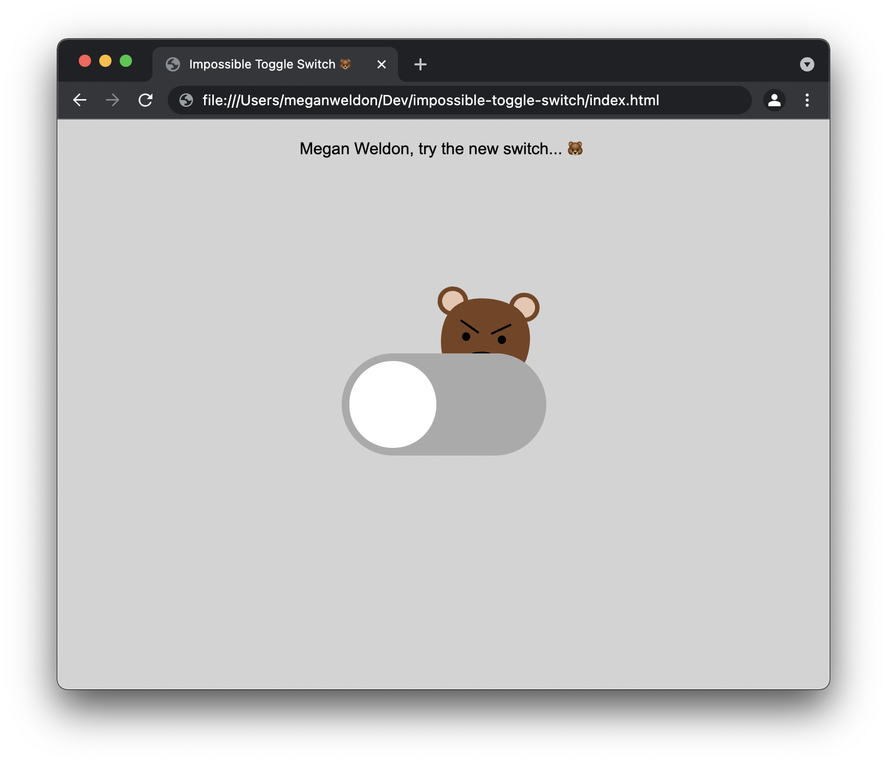

## Try The New Feature
Now try testing the new feature... but watch out for the mischievous bear! 🐻

# Targeting Your New Feature's Rollout
## Targeting Overview
LaunchDarkly additionally gives you enhanced controls to further de-risk any new feature rollouts by optionally targeting individual identifiers / users

## Identifiers / User Data
If you followed the steps above, your project is already sending user data to LaunchDarkly

- The below code inside `script.js` is one example of defined User identifiers, the (name + key) are the identifying values sent to LaunchDarkly

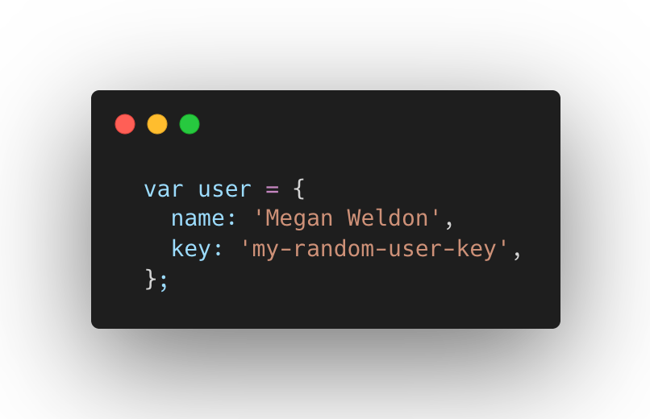

- Optional, edit the (name + key) values in your `script.js` as shown in the example below and re-run `index.html` to send additional unique users to LaunchDarkly for targeting (additional user identifiers and unique key hashing are also available)

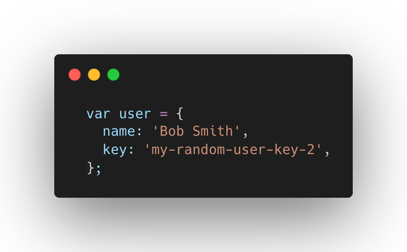

## User Targeting
Let's use LaunchDarkly's targeting to only show the new feature to specific users

- First let's target your new feature to only show for an individual user: `Megan Weldon`
- Inside your LaunchDarkly `Toggle Switch` > `Production` environment on the Feature Flags page, click the `New Toggle Switch` feature flag
- Within the Targeting tab, under Target individual users, click `Add User Targets`
- In the `True` field, click the dropdown to view users for targeting
- Select `Megan Weldon` (Optional: When hovering over users click `Add + Schedule Removal` to define a time window for how long you want the users to access the new feature)
- Set the `Default rule` for all other users to serve `False`
- Make sure the Targeting switch is `On` and `Save Changes`

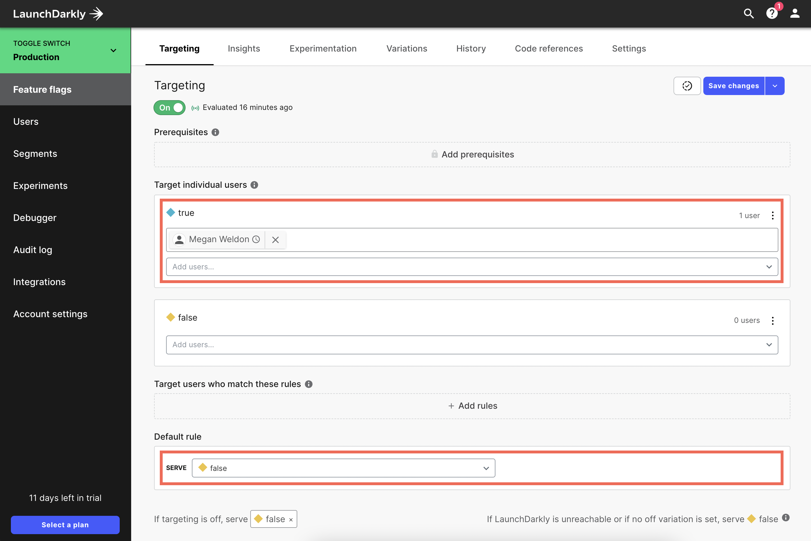

The above targeting example ensures only the targeted user `Megan Weldon` sees the new feature for a scheduled time period

